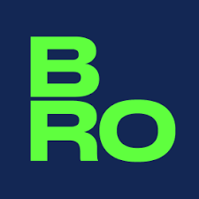

# Project: Brain Rocket Code Coverage and Instructions



This project includes test cases to ensure the functionality of JavaScript files such as `coffeeMachine.js`, `fibonacci.js`, and `longestAscendingSubsequence.js`. It uses Jest as the testing framework, and a code coverage report is generated automatically to evaluate the quality of the tests.

## Table of Contents

1. [Prerequisites](#prerequisites)
2. [Installation](#installation)
3. [Running Tests](#running-tests)
4. [Generating Code Coverage Report](#generating-code-coverage-report)
5. [Coverage Report](#coverage-report)
6. [Understanding Coverage Metrics](#understanding-coverage-metrics)

---

## Prerequisites

- [Node.js](https://nodejs.org/) installed on your machine (version 14 or above is recommended).
- A terminal or command-line interface.

---

## Installation

1. Clone the repository:

   ```bash
   git clone <repository-url>
   cd <repository-name>
   ```

2. Install the required dependencies:
   ```bash
   npm install
   ```

---

## Running Tests

Run all test cases with the following command:

```bash
npm test
```

This command will execute all Jest test cases in the project.

---

## Generating Code Coverage Report

To run the tests and generate a code coverage report, use:

```bash
npm test -- --coverage
```

### Coverage Report Output

1. The coverage report will be saved in the `coverage` directory.
2. Open the HTML report by navigating to:
   ```
   coverage/lcov-report/index.html
   ```
   Use any browser to view the detailed report.

---

## Coverage Report

Below is a snapshot of the already generated coverage report for this project:

### Summary

| Metric                  | Total | Covered | Coverage (%) |
| ----------------------- | ----- | ------- | ------------ |
| **Statements**          | 50    | 50      | 100%         |
| **Conditionals**        | 26    | 26      | 100%         |
| **Methods**             | 6     | 6       | 100%         |
| **Elements**            | 82    | 82      | 100%         |
| **Lines of Code (LOC)** | 50    | 50      | 100%         |

### File-wise Breakdown

1. **coffeeMachine.js**:

   - **Statements**: 16 (100% covered)
   - **Conditionals**: 8 (100% covered)
   - **Methods**: 4 (100% covered)

2. **fibonacci.js**:

   - **Statements**: 20 (100% covered)
   - **Conditionals**: 10 (100% covered)
   - **Methods**: 1 (100% covered)

3. **longestAscendingSubsequence.js**:
   - **Statements**: 14 (100% covered)
   - **Conditionals**: 8 (100% covered)
   - **Methods**: 1 (100% covered)

---

## Understanding Coverage Metrics

The coverage report includes the following metrics:

- **Statements**: The total number of executable statements in the code and how many of them are covered by tests.
- **Conditionals**: Branch coverage, representing the decision points (e.g., `if` conditions) and how many of them are tested.
- **Methods**: The total number of methods/functions and how many are tested.
- **Lines**: Total lines of code and the percentage covered by tests.

---

## Notes

- If you encounter issues during installation or testing, ensure your Node.js version is up-to-date and all dependencies are installed correctly.
# brainRocket
